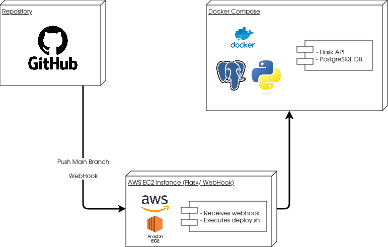

# Api Post Codes
Repository where the Data Engineer technical test was executed

## Diagram



## Local Configuration for Development

1. Clone the repository:
```
git clone https://github.com/tu_usuario/tu_repositorio.git
cd tu_repositorio
```
2. Install dependencies:
```
pip install -r requirements.txt
```
3. Stand up services locally with Docker Compose:
```
docker-compose up --build
```

### Contributions
1. Fork the project.
2. Create a new branch for your changes: ```git checkout -b feature/new-feature```.
3. Make your changes and commit: ```git commit -m "I added new functionality."```
4. Submit your changes: ```git push origin feature/new-feature```.
5. Create a Pull Request.